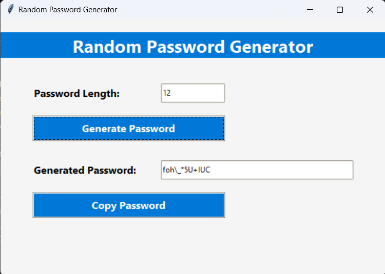

# Random Password Generator

This Random Password Generator application is a Python-based GUI tool designed to help users create secure and customizable passwords. Built with the Tkinter library, it offers an intuitive interface for generating random passwords with a specified length and copying them to the clipboard.

- Allows users to specify the desired password length (minimum 4 characters).
- Generates strong passwords containing lowercase letters, uppercase letters, digits, and special characters.

